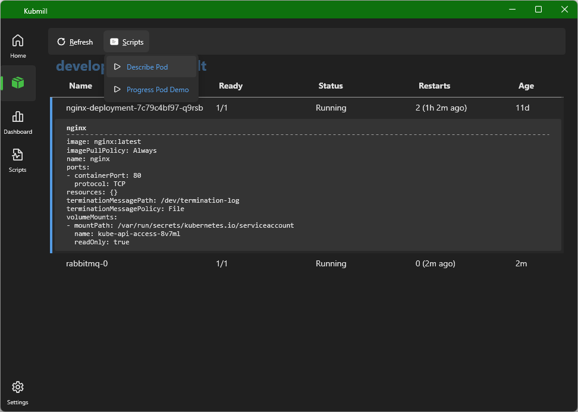

<b>Kubmill</b></h1>

Simple Kubernetes UI with scripting support.

> [!WARNING]
> Early development version

# Main functionalities (early version):
- show clusters with all namespaces
- view workload for selected namespace 
- run PowerShell scripts for selected items
- inspect simple dashboard for current context
- list available scripts

---

---

---

---
